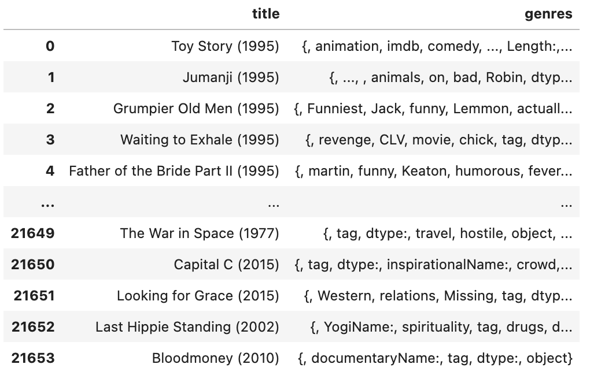

# Movie_Recommender_Spacy (project not finished)

This movie recommendation engine was created using Spacy word embeddings and computing the dot product and cosine similarity of the word embeddings. A word embedding is a vector representation of the word or words and in the case of Spacy, a 300 dimensional vector representation. After computing the dot product and cosine similarity I was able to return the top 5 movies in similarity. The dataset I used was from Kaggle link: https://www.kaggle.com/bandikarthik/movie-recommendation-system a 20,000 movie dataset with user ratings, titles, tags, timestamps, genres etc. The word embeddings were created off the tags of the movies. The tags contained summary descriptions of the movies which proved useful for our NLP application. 

The tags after they've been combined and cleaned. We then compute the dot product between the word embeddings of a movie and the entire dataset's word embeddings followed by a cosine similarity. 

For example, the top 5 similar movies for The Shawshank Redemption returned: 1. Annie Get Your Gun, 2. Kill Me Again, 3. Don Quixote, 4. Snow White, 5. The Best Little Whorehouse in Texas
