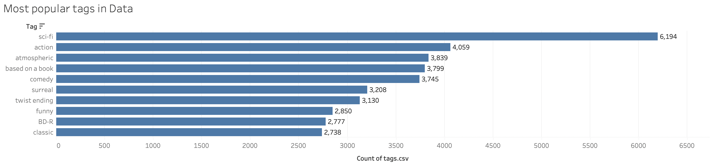
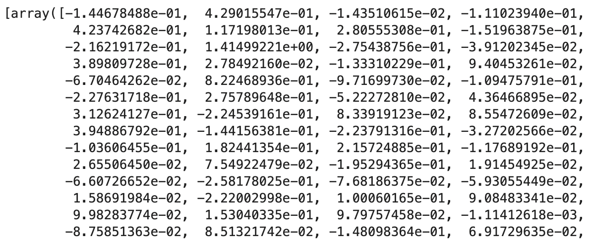

# Movie_Recommender_Spacy

### First_NB.ipynb is the project's main file
### Untitled.ipynb is a scrapbook for the recommendation algorithm done on another (not as comprehensive) movie dataset

This movie recommendation engine was created using Spacy word embeddings and computing the dot product and cosine similarity of the word embeddings. A word embedding is a vector representation of the word or words and in the case of Spacy, a 300 dimensional vector representation. After computing the dot product and cosine similarity I was able to return the top 5 movies in similarity. The dataset I used was from Kaggle link: https://www.kaggle.com/bandikarthik/movie-recommendation-system a 20,000 movie dataset with user ratings, titles, tags, timestamps, genres etc. The word embeddings were created off the tags of the movies. The tags contained summary descriptions of the movies which proved useful for our NLP application. 

The following are the most popular tags given for a movie

The word embeddings were then calculated as follows:

We then compute the dot product between the word embeddings of a movie and the entire dataset's word embeddings followed by a cosine similarity. 

For example, the top 5 similar movies for The Shawshank Redemption returned: 
1. Mumbai Police
2. The Hunger Games: Mockingjay - Part 2
3. The Dirt Bike Kid
4. Windstruck
5. Subramaniapuram

Link to project blog for further reading:
https://jeffreyng-82.medium.com/building-a-movie-recommender-based-on-spacy-word-embeddings-f32f2bdf8912

** Note I added a tfidf model which uses a sparse matrix, and a cosine similarity is calculated and the top 10 movies returned**
